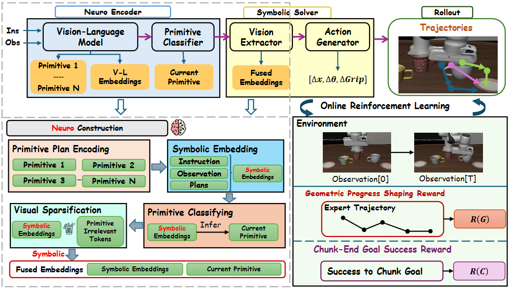

<div align="center">

# NS-VLA: Towards Neuro-Symbolic Vision-Language-Action Models

[](https://arxiv.org/abs/XXXX.XXXXX)
[](https://zuzuzzy.github.io/NS-VLA/)
[](https://huggingface.co/zuzuzzy/NS-VLA)
[](https://huggingface.co/datasets/zuzuzzy/NS-VLA-Dataset)
[](LICENSE)

[**Homepage**](https://zuzuzzy.github.io/NS-VLA/) | [**Paper**](https://arxiv.org/abs/XXXX.XXXXX) | [**Model**](https://huggingface.co/zuzuzzy/NS-VLA) | [**Dataset**](https://huggingface.co/datasets/zuzuzzy/NS-VLA-Dataset)
</div>

## Overview

**NS-VLA** is a novel **Neuro-Symbolic Vision-Language-Action** framework trained via online reinforcement learning. It introduces:

- 🧩 **Symbolic Encoder**: Embeds vision and language features and extracts structured primitives
- ⚡ **Symbolic Solver**: Lightweight solver for data-efficient action sequencing via visual token sparsification
- 🔄 **Online RL**: GRPO-based optimization with primitive-segmented rewards for expansive exploration

<p align="center">
  
</p>

## Performance

| Method | Params | LIBERO (Full) | LIBERO (1-shot) | LIBERO-Plus | CALVIN 5-Task |
|:---|:---:|:---:|:---:|:---:|:---:|
| OpenVLA | 7B | 76.5 | 35.7 | 15.6 | 43.5 |
| OpenVLA-OFT | 7B | 97.1 | 48.9 | 69.6 | 66.5 |
| π₀ | 3B | 94.2 | 37.4 | 53.6 | — |
| UniVLA | 7B | 95.2 | 55.1 | 42.9 | 56.5 |
| VLA-Adapter | 0.5B | 97.3 | 65.3 | 58.9 | 80.0 |
| **NS-VLA (Ours)** | **2B** | **98.6** | **69.1** | **79.4** | **91.2** |

## Installation

```bash
# Clone the repository
git clone https://github.com/Zuzuzzy/NS-VLA.git
cd NS-VLA

# Create conda environment
conda create -n nsvla python=3.10 -y
conda activate nsvla

# Install dependencies
pip install -r requirements.txt
```

## Project Structure

```
NS-VLA/
├── configs/                  # Training and evaluation configurations
│   ├── train/
│   └── eval/
├── nsvla/                    # Core NS-VLA framework
│   ├── encoder/              # Neuro-symbolic encoder
│   ├── solver/               # Symbolic solver and action generator
│   ├── rl/                   # Online RL optimization (GRPO)
│   ├── primitives/           # Primitive definitions and classifier
│   └── utils/                # Utility functions
├── scripts/                  # Training and evaluation scripts
│   ├── train.sh
│   ├── eval.sh
│   └── demo.sh
├── data/                     # Data processing and primitives
│   ├── libero/
│   ├── calvin/
│   └── primitive_annotations/
├── assets/                   # Figures and media
├── requirements.txt
├── setup.py
├── LICENSE
└── README.md
```

## Quick Start

### Training

```bash
# Stage I: Supervised pretraining
bash scripts/train.sh --stage pretrain --config configs/train/pretrain.yaml

# Stage II: Online RL optimization
bash scripts/train.sh --stage rl --config configs/train/rl_grpo.yaml
```

### Evaluation

```bash
# Evaluate on LIBERO
bash scripts/eval.sh --benchmark libero --checkpoint path/to/checkpoint

# Evaluate on CALVIN ABC→D
bash scripts/eval.sh --benchmark calvin --checkpoint path/to/checkpoint
```

## Docker JAX Inference API

A containerized JAX wrapper is provided under [`docker/`](docker/) that
exposes NS-VLA as an HTTP service. It ships a deterministic JAX
placeholder for the policy — the published model weights are not yet
released (the files under `nsvla/encoder/`, `nsvla/solver/`, etc. are
stubbed with *"Code will be released upon paper acceptance"*). The
wrapper locks in the real I/O contract (image + instruction → action
chunk + predicted symbolic primitive) so clients, benchmarks, and
integrations can be built against it today; swap `docker/model.py` for
the released checkpoint when it lands.

### Build & run

```bash
# Option A: docker compose
docker compose up --build

# Option B: plain docker
docker build -t nsvla-jax -f docker/Dockerfile .
docker run --rm -p 8000:8000 nsvla-jax
```

The service listens on `http://localhost:8000`. Configuration:

| Env var         | Default   | Meaning                                 |
|-----------------|-----------|-----------------------------------------|
| `NSVLA_HORIZON` | `8`       | Number of future action steps returned. |
| `NSVLA_PORT`    | `8000`    | Container port (also change `-p`).      |

### API endpoints

All responses are JSON. Interactive docs are auto-generated at
`http://localhost:8000/docs` (Swagger UI) and
`http://localhost:8000/redoc`.

#### `GET /health`
Liveness probe. Returns `{"status": "ok"}`. Used by the Docker
healthcheck.

#### `GET /info`
Model and runtime metadata: version, JAX backend/devices, action
horizon, action dimension, available primitives, and whether real
weights are loaded.

```bash
curl -s http://localhost:8000/info
```

#### `GET /primitives`
Returns the symbolic primitive vocabulary used by the neuro-symbolic
encoder (`pick`, `place_on`, `place_in`, `push`, `pull`, `open`,
`close`, `rotate`, `move_to`, `release`). Clients can use this to map
predicted primitive IDs to names.

#### `POST /predict`
Run inference from a JSON body with a base64-encoded image.

Request body:
```json
{
  "instruction": "pick up the red block and place it on the plate",
  "image_base64": "<base64-encoded RGB image>"
}
```

Response:
```json
{
  "primitive": "pick",
  "primitive_scores": {"pick": 1.23, "place_on": 0.41, "...": 0.0},
  "actions": [[dx, dy, dz, droll, dpitch, dyaw, gripper], ...],
  "horizon": 8,
  "action_dim": 7,
  "latency_ms": 12.4
}
```

- `actions` is a `horizon × 7` chunk of end-effector deltas; the last
  channel is the gripper command in `[0, 1]`.
- `primitive` is the top-1 symbolic primitive predicted by the encoder;
  `primitive_scores` gives raw logits over the full vocabulary.

Example:
```bash
python - <<'PY'
import base64, json, requests
img = base64.b64encode(open("assets/pipeline.png", "rb").read()).decode()
r = requests.post("http://localhost:8000/predict", json={
    "instruction": "pick up the red block",
    "image_base64": img,
})
print(json.dumps(r.json(), indent=2))
PY
```

#### `POST /predict/upload`
Same semantics as `/predict`, but takes `multipart/form-data` — easier
for `curl` and browsers.

Form fields:
- `instruction` *(string)* — the task instruction.
- `image`       *(file)*   — an RGB image file (PNG/JPEG).

```bash
curl -s -X POST http://localhost:8000/predict/upload \
  -F "instruction=open the drawer" \
  -F "image=@assets/pipeline.png"
```

### Errors

- `400 Bad Request` — malformed base64, unreadable image, or missing
  fields.
- `422 Unprocessable Entity` — Pydantic validation error on the JSON
  body.

### Replacing the placeholder with real weights

When NS-VLA weights are published, replace `NSVLAJaxModel._forward` in
`docker/model.py` with the Flax/JAX implementation of the encoder +
solver and load parameters from a checkpoint in
`NSVLAJaxModel.__init__`. The HTTP surface (`/predict`,
`/predict/upload`, `/info`, `/primitives`, `/health`) does not need to
change.

## Citation

If you find our work useful, please consider citing:

```bibtex
@article{zhu2026nsvla,
  title={NS-VLA: Towards Neuro-Symbolic Vision-Language-Action Models},
  author={Zhu, Ziyue and Wu, Shangyang and Zhao, Shuai and Zhao, Zhiqiu and Li, Shengjie and Wang, Yi and Li, Fang and Luo, Haoran},
  journal={arXiv preprint arXiv:XXXX.XXXXX},
  year={2026}
}
```

## Acknowledgement

We thank the developers of [LIBERO](https://github.com/Lifelong-Robot-Learning/LIBERO), [CALVIN](https://github.com/mees/calvin), [OpenVLA](https://github.com/openvla/openvla), and [Qwen-VL](https://github.com/QwenLM/Qwen-VL) for their open-source contributions.

## License

This project is licensed under the Apache License 2.0 - see the [LICENSE](LICENSE) file for details.
